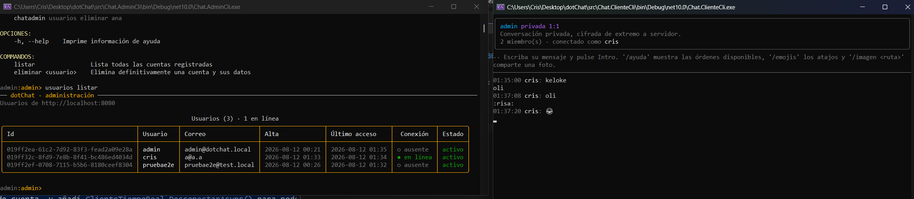
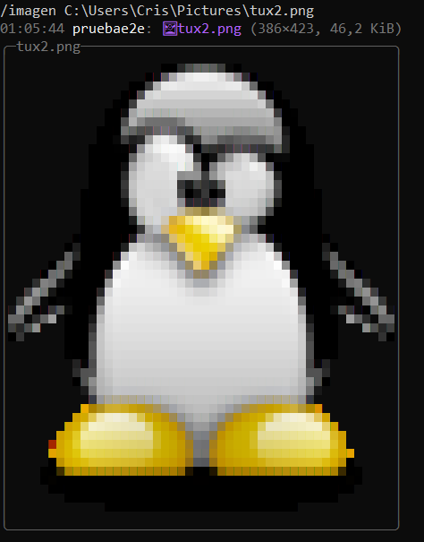
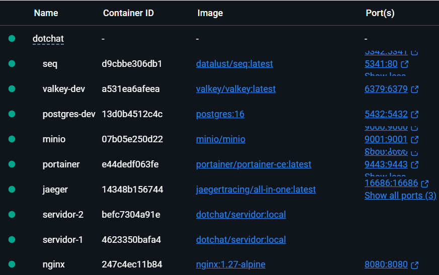
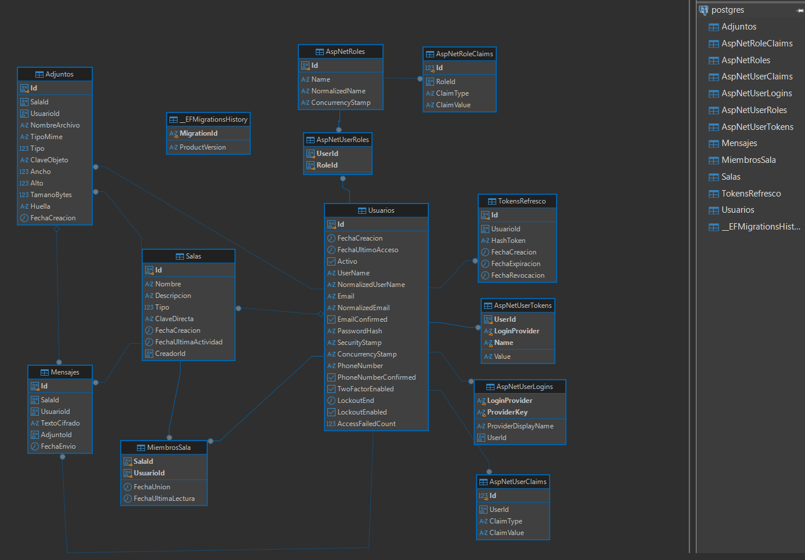
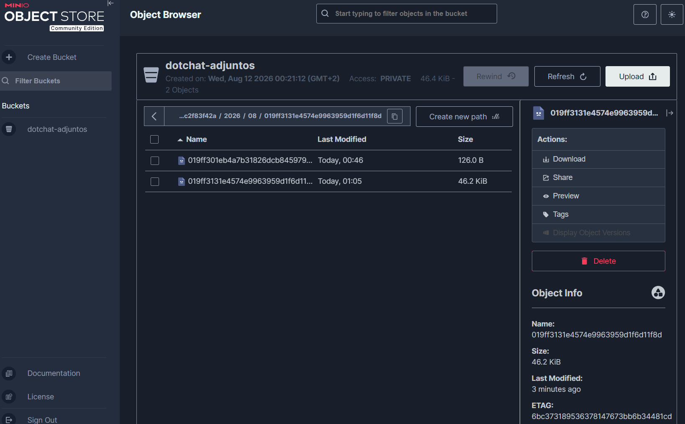
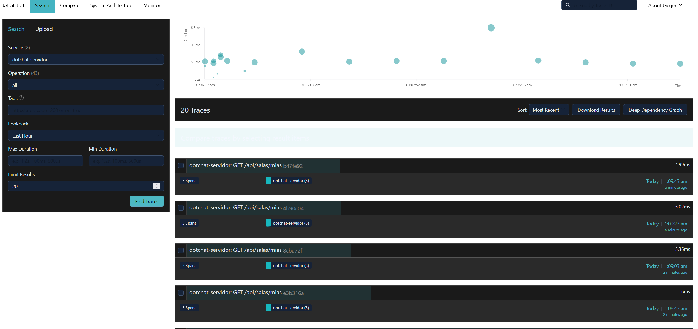
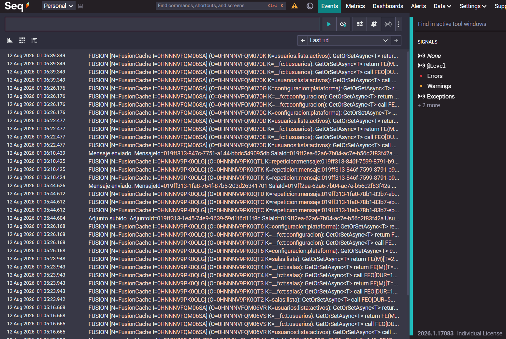

Plataforma de mensajería en tiempo real **totalmente local** 

---

## Qué es esto

dotChat es una app de mensajería instantánea que te montas tú mismo, en tu propio ordenador o servidor, sin depender de ningún proveedor externo.

si quieres montarlo con los colegas o algo pues un hamachi o un wireguard y a correr, pero no hace falta: puedes usarlo solo en tu máquina, sin abrir puertos ni nada y asi tienes tu propio chat privado sin que israel te espie 😭🥀

Nadie más puede leer tus conversaciones: los mensajes y las imágenes se cifran antes de tocar el disco, siempre.

Se maneja desde la terminal de momento no se cuando le montare una UI con react cuando me aburra seguramente 

- Salas públicas, privadas y conversaciones uno a uno.
- Mensajes en tiempo real, con avisos de "está escribiendo…" incluidos.
- Emojis (con atajos tipo `:fuego:`) e imágenes que se ven directamente en la consola, sin abrir nada.
- Saber al momento quién está conectado.
- Una consola aparte para administrar cuentas y salas.

<p align="center">
  
  <br>
  <em>Un administrador gestionando cuentas a la izquierda; una conversación privada cifrada, a la derecha.</em>
</p>

Y si alguien manda una foto, no te llega un enlace soso: se dibuja ahí mismo, en colores, dentro de la propia terminal.

<p align="center">
  
  <br>
  <em>Una imagen compartida con «/imagen», dibujada al vuelo con caracteres de bloque.</em>
</p>

## Cómo lo pruebas

Si tienes Docker instalado, esto es todo lo que hace falta:

```bash
./scripts/arrancar.ps1      # Windows
./scripts/arrancar.sh        # Linux / macOS, no lo he probado :P
```

El script genera las claves de cifrado, levanta todo el conjunto —servidor, base de datos, caché, almacén de archivos, balanceador y observabilidad— y avisa cuando está listo. Al terminar, la plataforma escucha en `http://localhost:8080` y te enseña una cuenta de administrador que solo se muestra una vez, así que apúntala.

Para hablar con ella:

```bash
dotnet run --project src/Chat.ClienteCli
```

Sin argumentos entra en modo aplicación: pide iniciar sesión o crear una cuenta y, a partir de ahí, va como cualquier chat de toda la vida — flechas para moverte, intro para abrir una conversación, y una tecla para cada cosa (nuevo privado, ver salas, cambiar de cuenta...).

## Por dentro

Decía que se me fue de las manos, y esto es la prueba: detrás de la consolita hay microservicios de verdad.

<p align="center">
  
  <br>
  <em>Todo el conjunto arriba: dos réplicas del servidor detrás de nginx, base de datos, caché, almacén de objetos y observabilidad.</em>
</p>

| Pieza | Para qué la uso |
| --- | --- |
| **.NET 10 / ASP.NET Core** | El servidor: la API, el hub de tiempo real y toda la lógica de negocio. |
| **PostgreSQL** | Donde vive todo, cifrado, con Entity Framework Core por encima. |
| **Valkey** (habla el protocolo de Redis) | Caché en dos niveles, presencia y el canal que conecta las réplicas del servidor entre sí. |
| **MinIO** | Almacén tipo S3 para las imágenes y archivos que se comparten. |
| **nginx** | Balanceador delante de las réplicas del servidor. |
| **Jaeger + Seq** | Trazas y logs estructurados, para saber qué ha pasado cuando algo falla. |
| **Docker Compose** | Levanta todo el conjunto con un solo comando. |

Arquitectura en capas (dominio, aplicación, infraestructura, servidor), sin marcos raros por encima: CQRS ligero hecho a mano, repositorios detrás de interfaces, y nada de "magia" que dé pereza explicar.

<p align="center">
  
  <br>
  <em>El modelo de datos: usuarios, salas, mensajes y adjuntos, junto a las tablas de Identity.</em>
</p>

Las imágenes y archivos se guardan cifrados en su propio almacén, separados de los mensajes:

<p align="center">
  
  <br>
  <em>Cada adjunto es un objeto cifrado; ni el propio almacén sabe qué contiene.</em>
</p>

Y si algo se rompe, no hace falta adivinar: cada petición deja traza y cada log queda correlacionado con ella.

<p align="center">
  
  <br>
  <em>Jaeger siguiendo cada petición de punta a punta.</em>
</p>

<p align="center">
  
  <br>
  <em>Seq, con todos los registros buscables y correlacionados con su traza.</em>
</p>

## Lo que es esto hoy

Si quieres los detalles finos —todos los comandos, la configuración, cada endpoint, cómo funciona el cifrado por dentro— tira del código o escribeme twin 🥀

---

## Licencia

**WTFPL — Do What The Fuck You Want To Public License, versión 2.**

Haz lo que te dé la gana con este código. El texto completo está en
[LICENSE](LICENSE).
